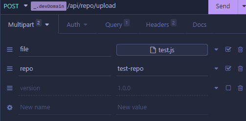

## JWT Authentication

### Admin

It is required to generate a `jwt` and `secret_key` to make the requests, for this you must use: 

```yarn token```

```npm run token```

> You can modify the default value of `secret_key` in `.env`, and it is highly recommended to do so.

With the generated token and also the secret key you can make the requests, to make a request just add the token and in the "Headers" section include a new header called "secret_key" and its value has to be the same that you used to generate the token.

```
curl 'http://localhost:8080/api/repo/test-repo' \
-H "secret_key: SECRET_KEY" \
-H "Authorization: Bearer TOKEN"
```

> Admin JWTs do not expire, it can be used as many times as you want.
### Guest

By default this is disabled, if you want to enable it you must go to the .env or set GUEST_JWT to true in the environment variables. And the usage is exactly like the admin JWT,but only read is allowed.

> Guest JWTs expire after 1h, after that you need to generate a new one.

## API Endpoints

### Guest

* '/api/guest/generate/token' (GET)

### Repos


* '/api/repo/all' (GET all repositories)
* '/api/repo/:repoid' (DELETE single repository and version folder)
* '/api/repo/:repo' (GET get all files related to this repository)
* '/api/repo/:repo/:ver' (GET file version from repository)
* '/api/repo/:repo/versions/historic' (GET all versions from repository)
* '/api/repo/:repo/versions/latest' (GET latest version from repository)
* '/api/repo/upload' (POST upload files and make the repository)

## How to upload


> version field is optional